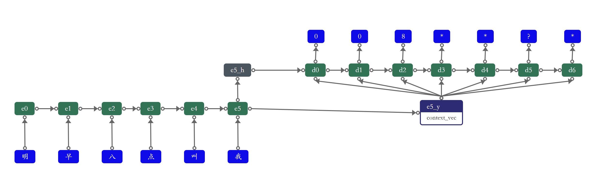

# nlp2cron


---

<div >
    
    
    
    <h4>Nlp2cron是一个将自然语言转换为cron表达式的工具包，可用于对话机器人的定时任务以及平常开发中的cron表达式识别</h4>
</div>


#### 使用教程

> 注：v1.1版本请移步[v1.1](README-v1.1.md)

##### 1.  引入依赖
```
 <dependency>
    <groupId>cn.langpy</groupId>
    <artifactId>nlp2cron</artifactId>
    <version>2.0.BETA</version>
  </dependency>
```
##### 2.  模型配置

[下载](https://gitee.com/huoyo/nlp2cron/releases)对应的发行版本的模型，并解压到任意目录，然后在代码种配置模型路径，如：

```java
CrondModel.init("d:/model");
```


##### 3.  使用

假设解压后的目录为

```
├─D
│  └─model
│         └─variables
│         └─saved_model.pb
```


> 注：目前仅支持时分秒的控制

```java
 public static void main(String[] args) {
        /*模型初始化，初始化需要时间，可提前进行初始化*/
        CrondModel.init("d:/model");
        String test1 = "明早八点";
        String test2 = "每天晚上7点开始";
        String test3 = "每15分钟一次";
        String test4 = "每2小时一次";
        String test5 = "每天晚上7点开始";
        String test6 = "每天早上7点开始";
        String test7 = "上午一点执行";
        String test8 = "明天早上8点";
        String cron1 = CrondUtil.toCron(test1);
        String cron2 = CrondUtil.toCron(test2);
        String cron3 = CrondUtil.toCron(test3);
        String cron4 = CrondUtil.toCron(test4);
        String cron5 = CrondUtil.toCron(test5);
        String cron6 = CrondUtil.toCron(test6);
        String cron7 = CrondUtil.toCron(test7);
        String cron8 = CrondUtil.toDate(test8);
        String cron9 = CrondUtil.toDateTime(test8);
        String cron10 = CrondUtil.toTime(test8);
        /*使用完关闭 如果在web中需要重复使用则不需要关闭*/
        CrondModel.close();
        //明早八点 转为cron表达式：0 0 8 3 1 ? 2021
        //每天晚上7点开始 转为cron表达式：0 0 19 * * ? *
        //每15分钟一次 转为cron表达式：0 0/15 * * * ? *
        //每2小时一次 转为cron表达式：0 0 0/2 * * ? *
        //每天晚上7点开始 转为cron表达式：0 0 19 * * ? *
        //每天早上7点开始 转为cron表达式：0 0 7 * * ? *
        //上午一点执行 转为cron表达式：0 0 1 * * ? *
        //明天早上八点 转为date表达式：2021-01-03
        //明天早上八点 转为datetime表达式：2021-01-03 08:00:00
        //明天早上八点 转为time表达式：08:00:00
}
```

#### 原理

实现原理为一个简易版本的seq2seq模型，对应的模型架构图如下：

> 1.直接使用全局向量编码进行预测
>
> 2.解码阶段假设状态h中已经包含了输出信息，所以不再使用上一个词的输出作为下一个词预测数输入
>
> 3.为了简化模型，加快收敛，解码和编码统一使用GRU




#### 版本说明

> V1.0：初始版本

> V2.0.BETA：基于tf2.0版本，优化模型大小与性能


